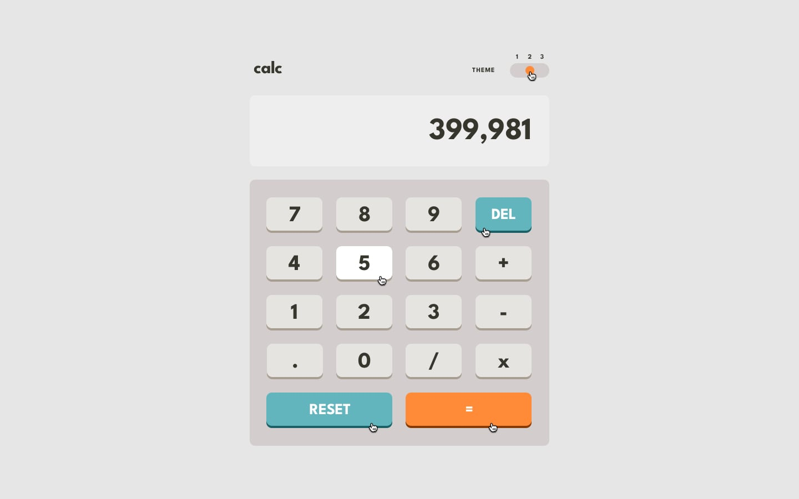

# Frontend Mentor - Calculator App

## Welcome! 👋

Frontend Mentor's Calculator App

# Design

## Desktop Design

Theme1 | Theme2 | Theme3
--- | --- | ---
 |  | 

## Active States
Theme1 | Theme2 | Theme3
--- | --- | ---
 |  | 

    
## Mobile Design
Theme1 | Theme2 | Theme3
--- | --- | ---
 |  | 

****

## Links

-   ### Solution URL : [here](https://www.frontendmentor.io/solutions/calculator-app-built-with-vanilla-typescript-sass-webpack5-EwzCV6ZL8c)
-   ### Live Site URL : [here](https://frontendmentor-calculator-app-lake.vercel.app/)
-   ### Github Repository URL : [here](https://github.com/minibrusp/frontendmentor-calculator-app)

****

## Built with
-   ### HTML5
-   ### VANILLA TYPESCRIPT
-   ### SCSS
-   ### WEBPACK 5
-   ### Mobile-first workflow
****

